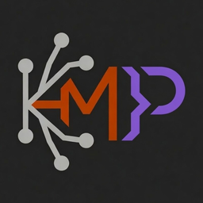

<p align="center">
  
</p>

# kmp-lsp
### Kotlin Multiplatform Language Server (Kotlin, Java, Swift)

[](https://crates.io/crates/kmp-lsp)
[](https://github.com/Hessesian/kmp-lsp/releases/latest)
[](https://github.com/Hessesian/kmp-lsp/actions/workflows/ci.yml)
[](LICENSE)

A fast, low-memory LSP server for **Kotlin**, **Java**, and **Swift**, written in Rust.
Built with [tree-sitter](https://tree-sitter.github.io/) — instant startup, no JVM.


**Why kmp-lsp?** Full navigation (hover, go-to-definition, completion, rename, semantic tokens) works immediately via an `rg` fallback and gets faster as the background index builds — instant startup, under 200 MB, no JVM or Gradle import required. Trade-off: syntactic (tree-sitter) resolution, not the full IntelliJ Analysis API. See the [full comparison](docs/features.md#vs-official-kotlin-lsp).

## Quick install

```bash
curl -fsSL https://raw.githubusercontent.com/Hessesian/kmp-lsp/main/install.sh | bash
```

Installs `kmp-lsp` and the native JAR indexer sidecar.

Library sources are auto-detected in most cases. **Missing hover docs/go-to-def for a dependency?** Force-extract them:

```bash
kmp-lsp extract-sources
```

## Learn more

- [Manual install & other methods](docs/install.md) — cargo, cargo-binstall, mise, mason.nvim, sidecar setup
- [Integrate with an AI agent](docs/copilot.md) — Copilot CLI, Serena MCP, agent skill file
- [More editors](docs/editors.md) — Helix, Neovim, VS Code, Zed
- [Features & CLI reference](docs/features.md) — capabilities, CLI subcommands, resolution chain, completion ranking
- [Configuration](docs/features.md#configuration) — workspace root, ignore patterns, source paths, `jarPaths`
- [Limitations & vs. official Kotlin LSP](docs/features.md#limitations)
- [Architecture](docs/architecture.md) · [Performance & profiling](docs/performance.md) · [Changelog](CHANGELOG.md)

## Acknowledgements

Superclass hierarchy resolution, `this`/`super` qualifier handling, and lambda parameter recognition were inspired by [**code-compass.nvim**](https://github.com/emmanueltouzery/code-compass.nvim) by Emmanuel Touzery.
