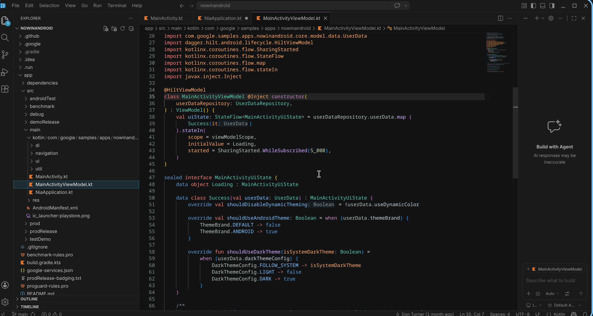

# Editor setup

`kmp-lsp` is at `~/.cargo/bin/kmp-lsp` after `cargo install`. Run `which kmp-lsp` to confirm it's on your `PATH`.

## VS Code



Download the `.vsix` for your platform from the [latest release](https://github.com/Hessesian/kmp-lsp/releases/latest) and install it:

```bash
# Linux x86_64
code --install-extension kmp-lsp-linux-x64-vX.Y.Z.vsix

# macOS Apple Silicon
code --install-extension kmp-lsp-darwin-arm64-vX.Y.Z.vsix

# macOS Intel
code --install-extension kmp-lsp-darwin-x64-vX.Y.Z.vsix
```

Or install the universal `.vsix` (no bundled binary — `kmp-lsp` must be on your `PATH`):

```bash
code --install-extension kmp-lsp-vX.Y.Z.vsix
```

The extension activates automatically for `.kt`, `.java`, and `.swift` files — no other Kotlin plugins needed.

> **Tip:** Disable other Kotlin extensions (`fwcd.kotlin`, `jetbrains.kotlin`) to avoid conflicts.

**Configuration** (optional) — in `.vscode/settings.json`:

```json
{
  "kmpLsp.path": "/path/to/kmp-lsp"
}
```

Default: `kmp-lsp` on `$PATH`.

**Install from source** (if you prefer to build locally):

```bash
cd contrib/vscode && npm install
ln -s "$(pwd)/contrib/vscode" ~/.vscode/extensions/kmp-lsp.kmp-lsp-client-0.0.1
```

## Helix

Add to `~/.config/helix/languages.toml`:

```toml
[[language]]
name = "kotlin"
language-servers = ["kmp-lsp"]
auto-format = false

[[language]]
name = "java"
language-servers = ["kmp-lsp"]
auto-format = false

[[language]]
name = "swift"
language-servers = ["kmp-lsp"]
auto-format = false

[language-server.kmp-lsp]
command = "kmp-lsp"
```

Restart Helix (or run `:lsp-restart`). Check the server is running: `:lsp-workspace-command` or watch `:log-open`.

### Bonus: JetBrains-style semantic highlighting

kmp-lsp emits LSP **semantic tokens** for Kotlin/Java/Swift, so highlighting goes
beyond what tree-sitter alone can color. Notably, it emits a `parameter` token for
**value parameters** — at the declaration *and* at every use-site inside the
function body — so parameters can be tinted distinctly from locals and properties
(the way IntelliJ does). Helix maps semantic tokens onto theme scopes, but most
themes leave `variable.parameter` unstyled, so out of the box parameters look like
plain identifiers.

The tokens kmp-lsp emits map to these Helix scopes:

| Semantic token | Helix scope | Colors |
| --- | --- | --- |
| `parameter` | `variable.parameter` | value parameters (decl + use-sites) |
| `typeParameter` | `type.parameter` | generic `<T>` |
| `decorator` | `attribute` | annotations |
| `keyword` | `keyword` | soft keywords (`is`, `as`, `by`, `in`) |
| `function` / `method` | `function` / `function.method` | calls and declarations |
| `namespace` | `namespace` | package / import paths |
| `class` / `interface` / `enum` / `struct` | `type` (+ `type.enum`) | type names |

To surface all of this in a JetBrains Darcula palette, save the theme below to
`~/.config/helix/themes/jetbrains_kotlin.toml` and set `theme = "jetbrains_kotlin"`
in `~/.config/helix/config.toml`. It extends Helix's built-in `jetbrains_dark` with
the scopes that base theme leaves out — `variable.parameter` (the value-parameter
color) chief among them:

```toml
# jetbrains_kotlin — extends jetbrains_dark with the scopes kmp-lsp's semantic
# tokens drive, matching the IntelliJ IDEA Darcula palette.
inherits = "jetbrains_dark"

# Annotations (tree-sitter @attribute + semantic DECORATOR token)
"attribute"               = { fg = "yellow_annotation" }

# Types: IntelliJ shows class/interface names as default text; enums purple.
"type"                    = { fg = "default_text" }
"type.enum"               = { fg = "purple_field" }
"type.enum.variant"       = { fg = "purple_field" }
"type.parameter"          = { fg = "teal_type_param" }   # <T>

# Value parameters (semantic PARAMETER token) — soft periwinkle, distinct from
# locals (default text) and properties (purple).
"variable.parameter"      = { fg = "periwinkle_param" }
"variable"                = { fg = "default_text" }

# Functions / methods: IntelliJ gold.
"function"                = { fg = "gold_method" }
"function.method"         = { fg = "gold_method" }
"function.macro"          = { fg = "gold_method" }

"operator"                = { fg = "default_text" }
"namespace"               = { fg = "default_text" }      # package names
"constant"                = { fg = "purple_field" }

# Semantic STATIC modifier → italic (IntelliJ marks static members italic)
"modifier"                = { fg = "orange_keyword", modifiers = ["italic"] }

# Keywords (tree-sitter @keyword* + semantic KEYWORD for soft keywords)
"keyword"                 = { fg = "orange_keyword" }
"keyword.control"         = { fg = "orange_keyword" }
"keyword.control.conditional" = { fg = "orange_keyword" }
"keyword.control.repeat"  = { fg = "orange_keyword" }
"keyword.control.return"  = { fg = "orange_keyword" }
"keyword.control.exception" = { fg = "orange_keyword" }
"keyword.control.import"  = { fg = "orange_keyword" }
"keyword.function"        = { fg = "orange_keyword" }
"keyword.operator"        = { fg = "orange_keyword" }

"constant.numeric"        = { fg = "blue_number" }

[palette]
periwinkle_param   = "#94BBFF"   # value parameters (PARAMETER token)
yellow_annotation  = "#BBB529"   # @annotation
gold_method        = "#FFC66D"   # function/method names
purple_field       = "#9876AA"   # fields, properties, enum entries
teal_type_param    = "#20999D"   # type parameters <T>
default_text       = "#A9B7C6"   # default identifier text
orange_keyword     = "#CC7832"   # keywords
blue_number        = "#6897BB"   # numeric literals
```

Semantic tokens are enabled automatically — no extra Helix config is needed beyond
the theme. (Requires a Helix build with LSP semantic-token support, which is the
default in current releases.)

## Neovim (nvim-lspconfig)

```lua
local lspconfig = require('lspconfig')
local configs   = require('lspconfig.configs')

if not configs.kmp_lsp then
  configs.kmp_lsp = {
    default_config = {
      cmd       = { 'kmp-lsp' },
      filetypes = { 'kotlin', 'java', 'swift' },
      root_dir  = lspconfig.util.root_pattern(
        'build.gradle', 'build.gradle.kts', 'pom.xml', 'settings.gradle', 'Package.swift', '.git'
      ),
      settings  = {},
    },
  }
end

lspconfig.kmp_lsp.setup {}
```

Place this in your `init.lua` (or a dedicated `after/ftplugin/kotlin.lua`).

**Completion** — pair with [nvim-cmp](https://github.com/hrsh7th/nvim-cmp):

```lua
require('cmp').setup {
  sources = {
    { name = 'nvim_lsp' },
    -- other sources …
  },
}
```

## Zed

### Recommended: install the extension

The `contrib/zed-extension` bundled in this repo registers `kmp-lsp` as a
first-class Zed language server, resolving the binary from `$PATH`. This is
the preferred setup — no manual `binary.path` wiring required.

**Install the binary first:**
```bash
cargo install kmp-lsp
```

**Install the extension:**
```bash
# From the repo root
zed --install-dev-extension contrib/zed-extension
```

Or copy the directory manually and restart Zed:
```bash
cp -r contrib/zed-extension ~/.config/zed/extensions/kmp-lsp
```

**Recommended `~/.config/zed/settings.json`** (suppresses the default JVM server and enables signature help):

```json
{
  "languages": {
    "Kotlin": {
      "language_servers": ["kmp-lsp", "!kotlin-language-server"],
      "format_on_save": "off",
      "show_completions_on_input": true,
      "show_completion_documentation": true
    },
    "Java": {
      "language_servers": ["kmp-lsp"],
      "format_on_save": "off",
      "show_completions_on_input": true
    },
    "Swift": {
      "language_servers": ["kmp-lsp"],
      "format_on_save": "off"
    }
  }
}
```

> **Signature help** appears automatically when you type `(` or `,` inside a call.
> It updates the active parameter as you add named arguments (`param = value, `).
> If it stops showing, check that `kotlin-language-server` (the JVM server) is not
> also active — it conflicts and the last responder wins.

### Without the extension (manual wiring)

If you prefer not to install the extension, add the full LSP config to
`~/.config/zed/settings.json`:

```json
{
  "languages": {
    "Kotlin": {
      "language_servers": ["kmp-lsp"],
      "format_on_save": "off",
      "show_completions_on_input": true,
      "show_completion_documentation": true
    },
    "Java": {
      "language_servers": ["kmp-lsp"],
      "format_on_save": "off"
    },
    "Swift": {
      "language_servers": ["kmp-lsp"],
      "format_on_save": "off"
    }
  },
  "lsp": {
    "kmp-lsp": {
      "binary": { "path": "kmp-lsp", "arguments": ["--stdio"] }
    }
  }
}
```

> **Note:** Zed requires a full restart (not just workspace reload) after changing
> LSP settings. Check **Zed → Help → Open Log** if the server doesn't start.
