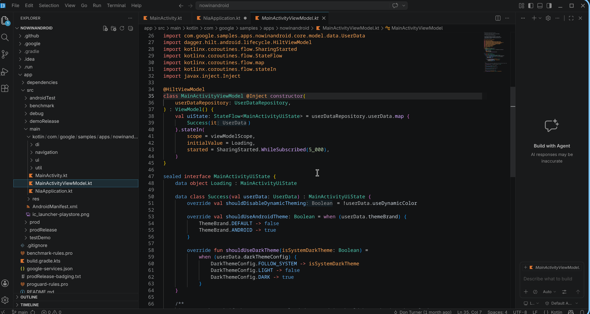

# Editor setup

`kmp-lsp` is at `~/.cargo/bin/kmp-lsp` after `cargo install`. Run `which kmp-lsp` to confirm it's on your `PATH`.

## VS Code



Download the `.vsix` for your platform from the [latest release](https://github.com/Hessesian/kmp-lsp/releases/latest) and install it:

```bash
# Linux x86_64
code --install-extension kmp-lsp-linux-x64-vX.Y.Z.vsix

# macOS Apple Silicon
code --install-extension kmp-lsp-darwin-arm64-vX.Y.Z.vsix

# macOS Intel
code --install-extension kmp-lsp-darwin-x64-vX.Y.Z.vsix
```

Or install the universal `.vsix` (no bundled binary — `kmp-lsp` must be on your `PATH`):

```bash
code --install-extension kmp-lsp-vX.Y.Z.vsix
```

The extension activates automatically for `.kt`, `.java`, and `.swift` files — no other Kotlin plugins needed.

> **Tip:** Disable other Kotlin extensions (`fwcd.kotlin`, `jetbrains.kotlin`) to avoid conflicts.

**Configuration** (optional) — in `.vscode/settings.json`:

```json
{
  "kmpLsp.path": "/path/to/kmp-lsp"
}
```

Default: `kmp-lsp` on `$PATH`.

**Install from source** (if you prefer to build locally):

```bash
cd contrib/vscode && npm install
ln -s "$(pwd)/contrib/vscode" ~/.vscode/extensions/kmp-lsp.kmp-lsp-client-0.0.1
```

## Helix

Add to `~/.config/helix/languages.toml`:

```toml
[[language]]
name = "kotlin"
language-servers = ["kmp-lsp"]
auto-format = false

[[language]]
name = "java"
language-servers = ["kmp-lsp"]
auto-format = false

[[language]]
name = "swift"
language-servers = ["kmp-lsp"]
auto-format = false

[language-server.kmp-lsp]
command = "kmp-lsp"
```

Restart Helix (or run `:lsp-restart`). Check the server is running: `:lsp-workspace-command` or watch `:log-open`.

### Bonus: JetBrains-style highlighting

kmp-lsp emits LSP **semantic tokens** for Kotlin/Java/Swift (a `parameter` token
for value parameters at both declaration and use-sites, `decorator` for
annotations, and so on), but Helix doesn't render LSP semantic tokens at all —
its highlighting comes entirely from tree-sitter queries. So none of that
directly colors anything in Helix; it matters for other semantic-token-aware
editors (see the sections below), not this one.

For Helix, everything below is driven by tree-sitter: a query file assigns
scope names to parse-tree nodes, and the theme paints those scope names. Helix's
stock Kotlin query already assigns most of what a JetBrains-style palette needs
(`type`, `function`, `keyword`, …), but it's missing a few scopes we want:
named-argument labels, annotation type names (a catch-all `@type` capture wins
over them otherwise), and the `by` delegation keyword. To add those, save
[`kotlin-highlights.scm`](themes/kotlin-highlights.scm) as
`~/.config/helix/runtime/queries/kotlin/highlights.scm`. It's a full copy of the
stock file (so it can shadow it) with three blocks layered in:

```scheme
; Ensure annotation names win over catch-all @type
(annotation
	(user_type
		(type_identifier) @attribute))
(annotation
	(constructor_invocation
		(user_type
			(type_identifier) @attribute)))

; Named argument labels (e.g., `overviewMapper =` in function calls)
(value_argument
  (simple_identifier) @variable.parameter
  .
  "=" @operator)

; Property delegation keyword 'by'
(property_delegate
  "by" @keyword)
```

Because it's a full-file override rather than a diff, it can drift from Helix's
own `runtime/queries/kotlin/highlights.scm` across upstream upgrades — re-diff
against the version bundled with your Helix install after updating and re-apply
these three blocks if the stock file has moved on.

With those scopes in place, save
[`jetbrains_kotlin.toml`](themes/jetbrains_kotlin.toml) to
`~/.config/helix/themes/jetbrains_kotlin.toml` and set `theme = "jetbrains_kotlin"`
in `~/.config/helix/config.toml` to paint them in a JetBrains Darcula palette. It
extends Helix's built-in `jetbrains_dark` with the scopes that base theme leaves
out — `variable.parameter` (the value-parameter color) chief among them. (Its
comments mention "semantic" tokens in a couple of places — read those as "the LSP
token of that name," describing the concept the scope corresponds to, not as a
claim that Helix consumes LSP semantic tokens; per above, it doesn't.)

```toml
# jetbrains_kotlin — extends jetbrains_dark with all missing scopes
# matching IntelliJ IDEA Darcula palette for Kotlin/Java development.
#
# Missing from base jetbrains_dark:
#   attribute/decorator, type, type.parameter, variable.parameter,
#   function.method, operator, namespace, constant, constructor, struct
inherits = "jetbrains_dark"

# ── Annotations ─────────────────────────────────────────────────────────────
# IntelliJ Darcula: #BBB529 (yellow-green). Both tree-sitter @attribute
# and LSP semantic DECORATOR token map here.
"attribute"               = { fg = "yellow_annotation" }

# ── Types ────────────────────────────────────────────────────────────────────
# IntelliJ: class names = default text (#A9B7C6); interfaces = italic default.
# Helix maps semantic CLASS/STRUCT/INTERFACE/ENUM all to "type" fallback.
"type"                    = { fg = "default_text" }
"type.enum"               = { fg = "purple_field" }           # enum type name stays purple
"type.enum.variant"       = { fg = "purple_field" }           # enum entries: #9876AA
"type.parameter"          = { fg = "teal_type_param" }        # <T>: #20999D

# ── Variables ────────────────────────────────────────────────────────────────
# Named argument labels emit PARAMETER (matches JetBrains official impl).
# Use a soft periwinkle blue — visually distinct from identifiers and properties.
"variable.parameter"      = { fg = "periwinkle_param" }       # #94BBFF
# Local variables: default text
"variable"                = { fg = "default_text" }

# ── Functions ────────────────────────────────────────────────────────────────
# IntelliJ Darcula method color: #FFC66D (gold/amber)
"function"                = { fg = "gold_method" }            # top-level fns
"function.method"         = { fg = "gold_method" }            # member methods
"function.macro"          = { fg = "gold_method" }            # macros/inline

# ── Operators / Namespace / Constants ───────────────────────────────────────
"operator"                = { fg = "default_text" }
"namespace"               = { fg = "default_text" }           # package names
"constant"                = { fg = "purple_field" }           # enum members fallback

# ── Modifiers ────────────────────────────────────────────────────────────────
# Semantic STATIC modifier → italic (IntelliJ marks static members italic)
"modifier"                = { fg = "orange_keyword", modifiers = ["italic"] }

# ── Keywords ─────────────────────────────────────────────────────────────────
# Override base jetbrains_dark (maps keyword → red207) with IntelliJ orange.
# Covers all tree-sitter @keyword* captures AND the semantic KEYWORD token
# (emitted for soft keywords: is, !is, as, as?, in, !in, by).
"keyword"                 = { fg = "orange_keyword" }
"keyword.control"         = { fg = "orange_keyword" }
"keyword.control.conditional" = { fg = "orange_keyword" }
"keyword.control.repeat"  = { fg = "orange_keyword" }
"keyword.control.return"  = { fg = "orange_keyword" }
"keyword.control.exception" = { fg = "orange_keyword" }
"keyword.control.import"  = { fg = "orange_keyword" }
"keyword.function"        = { fg = "orange_keyword" }
"keyword.operator"        = { fg = "orange_keyword" }

# ── Numbers: IntelliJ #6897BB (blue) ─────────────────────────────────────────
# Override the base theme's teal (#2aacb8) with IntelliJ blue
"constant.numeric"        = { fg = "blue_number" }

[palette]
# IntelliJ Darcula exact colors
periwinkle_param   = "#94BBFF"   # named argument labels (PARAMETER token)
yellow_annotation  = "#BBB529"   # @annotation, @attribute
gold_method        = "#FFC66D"   # function/method names
purple_field       = "#9876AA"   # fields, properties, enum entries
teal_type_param    = "#20999D"   # type parameters <T>
default_text       = "#A9B7C6"   # default identifier text
orange_keyword     = "#CC7832"   # keywords (base theme already close)
blue_number        = "#6897BB"   # numeric literals
```

## Neovim (nvim-lspconfig)

```lua
local lspconfig = require('lspconfig')
local configs   = require('lspconfig.configs')

if not configs.kmp_lsp then
  configs.kmp_lsp = {
    default_config = {
      cmd       = { 'kmp-lsp' },
      filetypes = { 'kotlin', 'java', 'swift' },
      root_dir  = lspconfig.util.root_pattern(
        'build.gradle', 'build.gradle.kts', 'pom.xml', 'settings.gradle', 'Package.swift', '.git'
      ),
      settings  = {},
    },
  }
end

lspconfig.kmp_lsp.setup {}
```

Place this in your `init.lua` (or a dedicated `after/ftplugin/kotlin.lua`).

**Completion** — pair with [nvim-cmp](https://github.com/hrsh7th/nvim-cmp):

```lua
require('cmp').setup {
  sources = {
    { name = 'nvim_lsp' },
    -- other sources …
  },
}
```

### Bonus: JetBrains-style highlighting

Unlike Helix, Neovim renders LSP semantic tokens directly — as `@lsp.type.*` /
`@lsp.mod.*` highlight groups — so there's no tree-sitter query file to patch
here; the port is two Lua files instead of a theme + a query override.

**Requires semantic tokens to be enabled** in your `on_attach`:

```lua
lspconfig.kmp_lsp.setup {
  on_attach = function(_, bufnr)
    vim.lsp.semantic_tokens.enable(true, { bufnr = bufnr })
  end,
}
```

Save [`jetbrains_dark.lua`](themes/jetbrains_dark.lua) to
`~/.config/nvim/colors/jetbrains_dark.lua` — it's a port of Helix's built-in
`jetbrains_dark` base theme (background, cursorline, statusline, popup menu,
diagnostics, base syntax groups), read straight from the palette Helix ships
so the two stay in sync. Load it in place of your current colorscheme:

```lua
vim.cmd.colorscheme("jetbrains_dark")
```

Then save [`jetbrains-kotlin.lua`](themes/jetbrains-kotlin.lua) to
`~/.config/nvim/lua/jetbrains-kotlin.lua` — this is the accent layer, ported
from `jetbrains_kotlin.toml`'s `[palette]`. It sets the `@lsp.type.*` groups
kmp-lsp's semantic tokens drive (parameters periwinkle, decorators
yellow-green, functions/methods gold, keywords orange, …) and re-applies
itself on the `ColorScheme` autocmd so it survives a `:colorscheme` switch.
Require it and call `apply()` right after loading the colorscheme:

```lua
vim.cmd.colorscheme("jetbrains_dark")
require("jetbrains-kotlin").apply()
```

## Zed

### Recommended: install the extension

The `contrib/zed-extension` bundled in this repo registers `kmp-lsp` as a
first-class Zed language server, resolving the binary from `$PATH`. This is
the preferred setup — no manual `binary.path` wiring required.

**Install the binary first:**
```bash
cargo install kmp-lsp
```

**Install the extension:**
```bash
# From the repo root
zed --install-dev-extension contrib/zed-extension
```

Or copy the directory manually and restart Zed:
```bash
cp -r contrib/zed-extension ~/.config/zed/extensions/kmp-lsp
```

**Recommended `~/.config/zed/settings.json`** (suppresses the default JVM server and enables signature help):

```json
{
  "languages": {
    "Kotlin": {
      "language_servers": ["kmp-lsp", "!kotlin-language-server"],
      "format_on_save": "off",
      "show_completions_on_input": true,
      "show_completion_documentation": true
    },
    "Java": {
      "language_servers": ["kmp-lsp"],
      "format_on_save": "off",
      "show_completions_on_input": true
    },
    "Swift": {
      "language_servers": ["kmp-lsp"],
      "format_on_save": "off"
    }
  }
}
```

> **Signature help** appears automatically when you type `(` or `,` inside a call.
> It updates the active parameter as you add named arguments (`param = value, `).
> If it stops showing, check that `kotlin-language-server` (the JVM server) is not
> also active — it conflicts and the last responder wins.

### Without the extension (manual wiring)

If you prefer not to install the extension, add the full LSP config to
`~/.config/zed/settings.json`:

```json
{
  "languages": {
    "Kotlin": {
      "language_servers": ["kmp-lsp"],
      "format_on_save": "off",
      "show_completions_on_input": true,
      "show_completion_documentation": true
    },
    "Java": {
      "language_servers": ["kmp-lsp"],
      "format_on_save": "off"
    },
    "Swift": {
      "language_servers": ["kmp-lsp"],
      "format_on_save": "off"
    }
  },
  "lsp": {
    "kmp-lsp": {
      "binary": { "path": "kmp-lsp", "arguments": ["--stdio"] }
    }
  }
}
```

> **Note:** Zed requires a full restart (not just workspace reload) after changing
> LSP settings. Check **Zed → Help → Open Log** if the server doesn't start.
